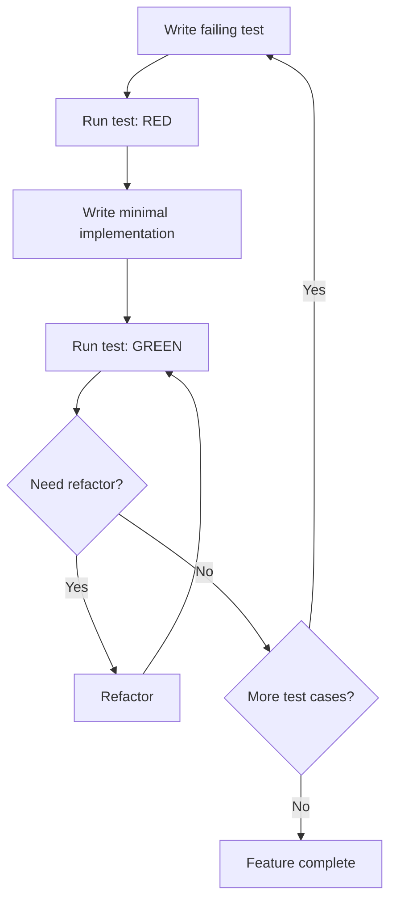

# TDD Implementation Guide for Smart Form Filler

> **Purpose:** Comprehensive guide to Test-Driven Development practices for the TypeScript migration project

## 📋 Table of Contents

- [What is TDD?](#what-is-tdd)
- [Why TDD for This Project?](#why-tdd-for-this-project)
- [TDD Workflow](#tdd-workflow)
- [Testing Framework](#testing-framework)
- [Practical Examples](#practical-examples)
- [Best Practices](#best-practices)
- [Common Pitfalls](#common-pitfalls)
- [Testing Patterns](#testing-patterns)

---

## 🎯 What is TDD?

**Test-Driven Development (TDD)** is a software development methodology where **tests are written before implementation code**.

### Core Cycle: Red-Green-Refactor

```
🔴 RED: Write a failing test
    ↓
🟢 GREEN: Write minimal code to pass the test
    ↓
🔵 REFACTOR: Optimize code while keeping tests green
    ↓
    (repeat)
```

### Benefits

- ✅ **Better Design:** Forces consideration of interfaces and dependencies
- ✅ **Higher Coverage:** Tests are written as features are developed
- ✅ **Regression Protection:** Immediate feedback when breaking changes occur
- ✅ **Documentation:** Tests serve as living usage examples
- ✅ **Confidence:** Refactor safely with test safety net

---

## 🚀 Why TDD for This Project?

### 1. Clean Slate Migration

Migrating from JavaScript to TypeScript provides a perfect opportunity to:
- Redesign architecture
- Establish solid type system
- Build comprehensive test suite from scratch

### 2. Complex Logic

Smart Form Filler has complex domain logic:
- AI API interactions
- Form detection algorithms
- Data extraction and transformation
- Multiple configuration options

TDD ensures each component works correctly in isolation and integration.

### 3. Browser Extension Constraints

Extension environments are hard to debug:
- Limited developer tools
- Sandboxed environment
- Cross-context communication

Good tests reduce need for manual debugging.

### 4. Team Collaboration

Tests serve as:
- **Specification documents** (what the code should do)
- **Usage examples** (how to use the API)
- **Regression protection** (prevent breaking changes)

---

## 🔄 TDD Workflow

### Basic Workflow (Per Feature)



### Practical Steps

#### 1. Red Phase (Write Failing Test)

```typescript
// src/config/__tests__/storageManager.test.ts
import { describe, it, expect, beforeEach, vi } from 'vitest';
import { StorageManager } from '../storageManager';

describe('StorageManager', () => {
  let storage: StorageManager;

  beforeEach(() => {
    storage = new StorageManager();
  });

  it('should save and retrieve data', async () => {
    const data = { key: 'value' };
    await storage.save('test', data);
    const retrieved = await storage.get('test');
    expect(retrieved).toEqual(data);
  });
});
```

**Run test:** `pnpm test` → **Result:** 🔴 RED (StorageManager doesn't exist yet)

#### 2. Green Phase (Minimal Implementation)

```typescript
// src/config/storageManager.ts
export class StorageManager {
  async save(key: string, data: unknown): Promise<void> {
    await chrome.storage.local.set({ [key]: data });
  }

  async get(key: string): Promise<unknown> {
    const result = await chrome.storage.local.get(key);
    return result[key];
  }
}
```

**Run test:** `pnpm test` → **Result:** 🟢 GREEN (Test passes)

#### 3. Refactor Phase (Optimize)

```typescript
// src/config/storageManager.ts
export class StorageManager<T = unknown> {
  async save(key: string, data: T): Promise<void> {
    try {
      await chrome.storage.local.set({ [key]: data });
    } catch (error) {
      throw new StorageError(`Failed to save ${key}`, error);
    }
  }

  async get(key: string): Promise<T | null> {
    try {
      const result = await chrome.storage.local.get(key);
      return result[key] ?? null;
    } catch (error) {
      throw new StorageError(`Failed to get ${key}`, error);
    }
  }
}
```

**Run test:** `pnpm test` → **Result:** 🟢 GREEN (Still passes, better code)

#### 4. Add More Test Cases

```typescript
it('should return null for non-existent key', async () => {
  const result = await storage.get('nonexistent');
  expect(result).toBeNull();
});

it('should overwrite existing data', async () => {
  await storage.save('test', { value: 1 });
  await storage.save('test', { value: 2 });
  const result = await storage.get('test');
  expect(result).toEqual({ value: 2 });
});

it('should handle Chrome storage errors', async () => {
  vi.spyOn(chrome.storage.local, 'set').mockRejectedValue(new Error('Storage full'));
  await expect(storage.save('test', {})).rejects.toThrow('Failed to save test');
});
```

---

## 🧪 Testing Framework

### Vitest Configuration

```typescript
// vitest.config.ts
import { defineConfig } from 'vitest/config';
import path from 'path';

export default defineConfig({
  test: {
    globals: true,
    environment: 'jsdom',
    setupFiles: ['./tests/setup.ts'],
    coverage: {
      provider: 'c8',
      reporter: ['text', 'json', 'html'],
      exclude: [
        'node_modules/',
        'tests/',
        '**/*.test.ts',
        '**/*.spec.ts',
      ],
    },
  },
  resolve: {
    alias: {
      '@': path.resolve(__dirname, './src'),
    },
  },
});
```

### Test Setup

```typescript
// tests/setup.ts
import { vi } from 'vitest';

// Mock Chrome API
global.chrome = {
  storage: {
    local: {
      get: vi.fn(),
      set: vi.fn(),
      remove: vi.fn(),
    },
  },
  runtime: {
    sendMessage: vi.fn(),
    onMessage: {
      addListener: vi.fn(),
    },
  },
} as any;
```

---

## 💡 Practical Examples

### Example 1: API Configuration Manager

#### Step 1: Define Interface (Type-First)

```typescript
// src/types/config.ts
export interface ApiConfig {
  provider: 'azure' | 'ollama';
  name: string;
  apiKey?: string;
  endpoint: string;
  model: string;
}

export interface IApiConfigManager {
  saveConfig(config: ApiConfig): Promise<void>;
  getConfig(name: string): Promise<ApiConfig | null>;
  listConfigs(): Promise<ApiConfig[]>;
  deleteConfig(name: string): Promise<void>;
}
```

#### Step 2: Write Test Cases

```typescript
// src/config/__tests__/apiConfigManager.test.ts
import { describe, it, expect, beforeEach, vi } from 'vitest';
import { ApiConfigManager } from '../apiConfigManager';
import type { ApiConfig } from '@/types/config';

describe('ApiConfigManager', () => {
  let manager: ApiConfigManager;

  beforeEach(() => {
    vi.clearAllMocks();
    manager = new ApiConfigManager();
  });

  describe('saveConfig', () => {
    it('should save Azure config successfully', async () => {
      const config: ApiConfig = {
        provider: 'azure',
        name: 'My Azure',
        apiKey: 'sk-test',
        endpoint: 'https://my-resource.openai.azure.com',
        model: 'gpt-4',
      };

      await manager.saveConfig(config);
      const retrieved = await manager.getConfig('My Azure');
      expect(retrieved).toEqual(config);
    });

    it('should encrypt API key before saving', async () => {
      const config: ApiConfig = {
        provider: 'azure',
        name: 'Test',
        apiKey: 'secret-key',
        endpoint: 'https://test.com',
        model: 'gpt-4',
      };

      const setSpy = vi.spyOn(chrome.storage.local, 'set');
      await manager.saveConfig(config);

      const savedData = setSpy.mock.calls[0][0];
      expect(savedData['api_configs']).toBeDefined();
      const savedConfig = savedData['api_configs'].find((c: any) => c.name === 'Test');
      expect(savedConfig.apiKey).not.toBe('secret-key'); // Encrypted
    });

    it('should validate config before saving', async () => {
      const invalidConfig = {
        provider: 'invalid',
        name: '',
      } as any;

      await expect(manager.saveConfig(invalidConfig)).rejects.toThrow('Invalid config');
    });
  });

  describe('getConfig', () => {
    it('should return null for non-existent config', async () => {
      const result = await manager.getConfig('NonExistent');
      expect(result).toBeNull();
    });

    it('should decrypt API key when retrieving', async () => {
      const config: ApiConfig = {
        provider: 'azure',
        name: 'Test',
        apiKey: 'secret-key',
        endpoint: 'https://test.com',
        model: 'gpt-4',
      };

      await manager.saveConfig(config);
      const retrieved = await manager.getConfig('Test');
      expect(retrieved?.apiKey).toBe('secret-key'); // Decrypted
    });
  });
});
```

#### Step 3: Implement

```typescript
// src/config/apiConfigManager.ts
import type { ApiConfig, IApiConfigManager } from '@/types/config';
import { StorageManager } from './storageManager';
import { encrypt, decrypt } from '@/utils/crypto';

const STORAGE_KEY = 'api_configs';

export class ApiConfigManager implements IApiConfigManager {
  private storage = new StorageManager<ApiConfig[]>();

  async saveConfig(config: ApiConfig): Promise<void> {
    this.validateConfig(config);

    const configs = await this.getAllConfigs();
    const existingIndex = configs.findIndex(c => c.name === config.name);

    // Encrypt API key
    const configToSave = {
      ...config,
      apiKey: config.apiKey ? await encrypt(config.apiKey) : undefined,
    };

    if (existingIndex >= 0) {
      configs[existingIndex] = configToSave;
    } else {
      configs.push(configToSave);
    }

    await this.storage.save(STORAGE_KEY, configs);
  }

  async getConfig(name: string): Promise<ApiConfig | null> {
    const configs = await this.getAllConfigs();
    const config = configs.find(c => c.name === name);

    if (!config) return null;

    // Decrypt API key
    return {
      ...config,
      apiKey: config.apiKey ? await decrypt(config.apiKey) : undefined,
    };
  }

  async listConfigs(): Promise<ApiConfig[]> {
    const configs = await this.getAllConfigs();
    // Return without API keys for security
    return configs.map(({ apiKey, ...rest }) => rest as ApiConfig);
  }

  async deleteConfig(name: string): Promise<void> {
    const configs = await this.getAllConfigs();
    const filtered = configs.filter(c => c.name !== name);
    await this.storage.save(STORAGE_KEY, filtered);
  }

  private async getAllConfigs(): Promise<ApiConfig[]> {
    return (await this.storage.get(STORAGE_KEY)) ?? [];
  }

  private validateConfig(config: ApiConfig): void {
    if (!config.name?.trim()) {
      throw new Error('Invalid config: name is required');
    }
    if (!['azure', 'ollama'].includes(config.provider)) {
      throw new Error('Invalid config: provider must be azure or ollama');
    }
    if (!config.endpoint?.trim()) {
      throw new Error('Invalid config: endpoint is required');
    }
    if (config.provider === 'azure' && !config.apiKey?.trim()) {
      throw new Error('Invalid config: apiKey is required for Azure');
    }
  }
}
```

### Example 2: AI Service with Adapter Pattern

#### Test First

```typescript
// src/services/ai/__tests__/aiServiceFactory.test.ts
describe('AIServiceFactory', () => {
  it('should create Azure OpenAI service', () => {
    const config: ApiConfig = {
      provider: 'azure',
      name: 'Test',
      endpoint: 'https://test.com',
      apiKey: 'key',
      model: 'gpt-4',
    };

    const service = AIServiceFactory.create(config);
    expect(service).toBeInstanceOf(AzureOpenAIService);
  });

  it('should create Ollama service', () => {
    const config: ApiConfig = {
      provider: 'ollama',
      name: 'Test',
      endpoint: 'http://localhost:11434',
      model: 'llama2',
    };

    const service = AIServiceFactory.create(config);
    expect(service).toBeInstanceOf(OllamaService);
  });
});
```

#### Implementation

```typescript
// src/services/ai/aiServiceFactory.ts
export class AIServiceFactory {
  static create(config: ApiConfig): IAIService {
    switch (config.provider) {
      case 'azure':
        return new AzureOpenAIService(config);
      case 'ollama':
        return new OllamaService(config);
      default:
        throw new Error(`Unsupported provider: ${config.provider}`);
    }
  }
}
```

---

## 📚 Best Practices

### 1. Test Structure: AAA Pattern

```typescript
it('should do something', async () => {
  // Arrange: Setup
  const input = { value: 1 };
  const expected = { value: 2 };

  // Act: Execute
  const result = await myFunction(input);

  // Assert: Verify
  expect(result).toEqual(expected);
});
```

### 2. Test Naming

```typescript
// ✅ Good: Describes behavior
it('should return null when config does not exist', () => {});
it('should encrypt API key before saving', () => {});
it('should retry failed requests with exponential backoff', () => {});

// ❌ Bad: Vague descriptions
it('test save', () => {});
it('works correctly', () => {});
```

### 3. One Assertion per Test

```typescript
// ✅ Good
it('should save config', async () => {
  await manager.saveConfig(config);
  const saved = await manager.getConfig(config.name);
  expect(saved).toBeDefined();
});

it('should encrypt apiKey when saving', async () => {
  await manager.saveConfig(config);
  const raw = await getRawStorage();
  expect(raw.apiKey).not.toBe(config.apiKey);
});

// ❌ Bad: Multiple unrelated assertions
it('should handle configs', async () => {
  await manager.saveConfig(config);
  expect(await manager.getConfig(config.name)).toBeDefined();
  expect(await manager.listConfigs()).toHaveLength(1);
  await manager.deleteConfig(config.name);
  expect(await manager.getConfig(config.name)).toBeNull();
});
```

### 4. Mock External Dependencies

```typescript
// Mock Chrome API
vi.mock('chrome', () => ({
  storage: {
    local: {
      get: vi.fn().mockResolvedValue({}),
      set: vi.fn().mockResolvedValue(undefined),
    },
  },
}));

// Mock fetch
global.fetch = vi.fn();
```

### 5. Clean Up After Tests

```typescript
beforeEach(() => {
  vi.clearAllMocks();
});

afterEach(() => {
  vi.restoreAllMocks();
});
```

---

## 🎭 Testing Patterns

### Test Pyramid

```
        ┌─────────────┐
        │   E2E Tests │  10% - Slowest, Most Expensive
        │   (Slow)    │
        ├─────────────┤
        │ Integration │  20% - Medium Speed
        │   Tests     │
        │  (Medium)   │
        ├─────────────┤
        │    Unit     │  70% - Fastest, Least Expensive
        │    Tests    │
        │   (Fast)    │
        └─────────────┘
```

**Distribution Strategy:**
- **70% Unit Tests:** Fast feedback, test individual functions/classes
- **20% Integration Tests:** Test module interactions
- **10% E2E Tests:** Test complete user workflows

### Pattern 1: Test Data Builders

```typescript
// tests/builders/configBuilder.ts
export class ConfigBuilder {
  private config: Partial<ApiConfig> = {
    provider: 'azure',
    name: 'Test',
    endpoint: 'https://test.com',
    model: 'gpt-4',
  };

  withAzure(): this {
    this.config.provider = 'azure';
    this.config.apiKey = 'sk-test';
    return this;
  }

  withOllama(): this {
    this.config.provider = 'ollama';
    this.config.endpoint = 'http://localhost:11434';
    delete this.config.apiKey;
    return this;
  }

  withName(name: string): this {
    this.config.name = name;
    return this;
  }

  build(): ApiConfig {
    return this.config as ApiConfig;
  }
}

// Usage in tests
const config = new ConfigBuilder()
  .withOllama()
  .withName('My Ollama')
  .build();
```

### Pattern 2: Mock Service Worker (MSW) Setup

```typescript
// tests/mocks/handlers.ts
import { http, HttpResponse } from 'msw';

export const handlers = [
  // Mock Azure OpenAI API
  http.post('https://*.openai.azure.com/openai/deployments/*/chat/completions', () => {
    return HttpResponse.json({
      choices: [{
        message: {
          role: 'assistant',
          content: 'Mocked response'
        }
      }],
      usage: {
        prompt_tokens: 10,
        completion_tokens: 20,
        total_tokens: 30
      }
    });
  }),
  
  // Mock Ollama API
  http.post('http://localhost:11434/api/chat', () => {
    return HttpResponse.json({
      message: {
        role: 'assistant',
        content: 'Mocked Ollama response'
      }
    });
  }),
  
  // Mock Error Response
  http.post('https://error.example.com/*', () => {
    return new HttpResponse(null, { status: 500 });
  })
];

// tests/setup.ts
import { setupServer } from 'msw/node';
import { handlers } from './mocks/handlers';

export const server = setupServer(...handlers);

beforeAll(() => server.listen());
afterEach(() => server.resetHandlers());
afterAll(() => server.close());
```

**Using MSW in Tests:**

```typescript
describe('AzureOpenAIService', () => {
  it('should call API with correct parameters', async () => {
    const service = new AzureOpenAIService(testConfig);
    
    const response = await service.chat([
      { role: 'user', content: 'Hello' }
    ]);
    
    // MSW automatically intercepts and returns mock data
    expect(response.choices[0].message.content).toBe('Mocked response');
    expect(response.usage.total_tokens).toBe(30);
  });
  
  it('should handle API errors', async () => {
    // Override specific request handler
    server.use(
      http.post('https://*.openai.azure.com/*', () => {
        return new HttpResponse(null, { status: 500 });
      })
    );
    
    const service = new AzureOpenAIService(testConfig);
    
    await expect(service.chat([...])).rejects.toThrow();
  });
  
  it('should retry on rate limit', async () => {
    let callCount = 0;
    
    server.use(
      http.post('https://*.openai.azure.com/*', () => {
        callCount++;
        if (callCount === 1) {
          return new HttpResponse(null, { 
            status: 429,
            headers: { 'Retry-After': '1' }
          });
        }
        return HttpResponse.json({
          choices: [{ message: { content: 'Success' } }]
        });
      })
    );
    
    const service = new AzureOpenAIService(testConfig);
    const response = await service.chat([{ role: 'user', content: 'Hi' }]);
    
    expect(callCount).toBe(2); // Should retry once
    expect(response.choices[0].message.content).toBe('Success');
  });
});
```

### Pattern 3: Fake Timers

```typescript
describe('Retry Logic', () => {
  beforeEach(() => {
    vi.useFakeTimers();
  });
  
  afterEach(() => {
    vi.useRealTimers();
  });
  
  it('should retry with exponential backoff', async () => {
    let attempts = 0;
    const mockFn = vi.fn().mockImplementation(() => {
      attempts++;
      if (attempts < 3) {
        throw new Error('Temporary error');
      }
      return 'success';
    });
    
    const promise = retryWithBackoff(mockFn, { maxRetries: 3 });
    
    // Fast-forward time to trigger retries
    await vi.advanceTimersByTimeAsync(1000); // 1st retry (1s)
    await vi.advanceTimersByTimeAsync(2000); // 2nd retry (2s)
    
    const result = await promise;
    
    expect(attempts).toBe(3);
    expect(result).toBe('success');
  });
});
```

---

## ⚠️ Common Pitfalls

### 1. ❌ Testing Implementation Details

```typescript
// ❌ Bad: Tests internal implementation
it('should call encrypt function', () => {
  const spy = vi.spyOn(crypto, 'encrypt');
  manager.saveConfig(config);
  expect(spy).toHaveBeenCalled();
});

// ✅ Good: Tests behavior
it('should not store plain text API key', async () => {
  await manager.saveConfig(config);
  const raw = await getRawStorage();
  expect(raw.apiKey).not.toBe(config.apiKey);
});
```

### 2. ❌ Overly Complex Tests

```typescript
// ❌ Bad: Too much setup logic
it('should work with complex scenario', async () => {
  const setup = createComplexSetup();
  const data = transformData(setup);
  const processed = await processData(data);
  // ... 20 more lines
});

// ✅ Good: Extract to helper
const setupComplexScenario = () => {
  // ... setup logic
  return { input, expected };
};

it('should work with complex scenario', async () => {
  const { input, expected } = setupComplexScenario();
  const result = await myFunction(input);
  expect(result).toEqual(expected);
});
```

### 3. ❌ Non-Deterministic Tests

```typescript
// ❌ Bad: Uses current time
it('should set timestamp', () => {
  const result = createRecord();
  expect(result.timestamp).toBe(Date.now()); // Flaky!
});

// ✅ Good: Mock time
it('should set timestamp', () => {
  vi.useFakeTimers();
  vi.setSystemTime(new Date('2024-01-01'));

  const result = createRecord();
  expect(result.timestamp).toBe(new Date('2024-01-01').getTime());

  vi.useRealTimers();
});
```

---

## 🎨 Testing Patterns

### Pattern 1: Builder Pattern for Test Data

```typescript
// tests/builders/configBuilder.ts
export class ConfigBuilder {
  private config: Partial<ApiConfig> = {
    provider: 'azure',
    name: 'Test',
    endpoint: 'https://test.com',
    model: 'gpt-4',
  };

  withAzure(): this {
    this.config.provider = 'azure';
    this.config.apiKey = 'sk-test';
    return this;
  }

  withOllama(): this {
    this.config.provider = 'ollama';
    this.config.endpoint = 'http://localhost:11434';
    delete this.config.apiKey;
    return this;
  }

  withName(name: string): this {
    this.config.name = name;
    return this;
  }

  build(): ApiConfig {
    return this.config as ApiConfig;
  }
}

// Usage in tests
const config = new ConfigBuilder()
  .withOllama()
  .withName('My Ollama')
  .build();
```

### Pattern 2: Custom Matchers

```typescript
// tests/matchers.ts
expect.extend({
  toBeValidConfig(received: unknown) {
    const isValid =
      typeof received === 'object' &&
      received !== null &&
      'provider' in received &&
      'name' in received;

    return {
      pass: isValid,
      message: () => `Expected ${received} to be a valid ApiConfig`,
    };
  },
});

// Usage
expect(config).toBeValidConfig();
```

### Pattern 3: Snapshot Testing

```typescript
it('should generate correct HTML structure', () => {
  const html = generateFormHTML(formData);
  expect(html).toMatchSnapshot();
});
```

---

## 📊 Coverage Monitoring

### Run Coverage Report

```bash
# Generate coverage report
pnpm test:coverage

# View HTML report
open coverage/index.html
```

### Coverage Thresholds

```typescript
// vitest.config.ts
export default defineConfig({
  test: {
    coverage: {
      statements: 80,
      branches: 80,
      functions: 80,
      lines: 80,
    },
  },
});
```

---

## 🔗 Reference Resources

- [Vitest Official Documentation](https://vitest.dev/)
- [Test Driven Development by Example - Kent Beck](https://www.amazon.com/Test-Driven-Development-Kent-Beck/dp/0321146530)
- [Growing Object-Oriented Software, Guided by Tests](https://www.amazon.com/Growing-Object-Oriented-Software-Guided-Tests/dp/0321503627)

---

**Last Updated:** November 7, 2025  
**Document Version:** 2.0.0
