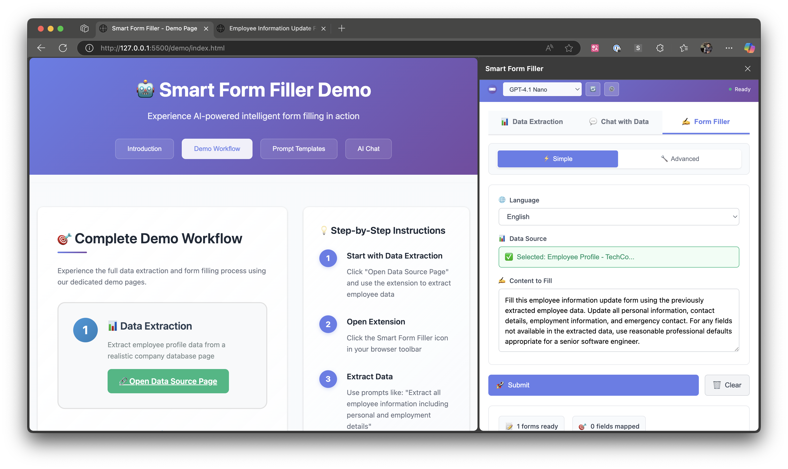

# Smart Form Filler - AI-Powered Browser Extension

A standalone browser extension for intelligent data extraction and form filling using AI technology. Now with **Ollama local model support**!

[](https://github.com/hddevteam/smart-form-filler/releases)
[](LICENSE)
[](https://github.com/hddevteam/smart-form-filler)
[](https://github.com/hddevteam/smart-form-filler)

🚀 **[Try Interactive Demo](https://hddevteam.github.io/smart-form-filler/)** | 📦 **[Download Latest Release](https://github.com/hddevteam/smart-form-filler/releases/latest)** | 📖 **[View Documentation](https://github.com/hddevteam/smart-form-filler/wiki)**

## � Language Versions

- [🇺🇸 English](README.md) | [🇨🇳 中文](README_zh.md)

## �🎬 Demo Video

**📹 Watch the complete demonstration** of Smart Form Filler in action:

**🎥 Online Preview**: [**Watch Video Directly in Browser**](https://demoforgithub.blob.core.windows.net/videos/smart-form-filler-demo.mp4) *(Click to play instantly)*

**📥 Alternative**: [](../../releases/latest/download/smart-form-filler-demo.mp4)

**🌐 Interactive Demo**: [**Try Smart Form Filler Live**](https://hddevteam.github.io/smart-form-filler/) *(Experience all features in your browser)*

## 📸 Screenshots



*Smart Form Filler analyzing and auto-filling a complex web form*

> **💡 Tip**: The demo showcases all major features including AI-powered form filling, data extraction

## 🚀 Features

- **Data Extraction**: Extract structured data from web pages
- **Smart Form Filling**: AI-powered automatic form completion with intelligent field mapping
- **Multi-format Output**: Raw HTML, cleaned HTML, and Markdown formats
- **Chat with Data**: Interactive Q&A with extracted content
- **Local AI Models**: Full Ollama integration for privacy-focused AI
- **Cloud AI Models**: Support for GPT-4o, o series, DeepSeek, and other cloud providers
- **Backend Configuration**: Built-in settings interface for configuring backend connections
- **Service Status Monitoring**: Real-time backend connection status and error handling
- **Intelligent Field Analysis**: Enhanced field descriptions including available options for dropdowns, radio buttons, and checkboxes
- **Browser Integration**: Works seamlessly with Chrome and other Chromium-based browsers

## 📁 Project Structure

```
smart-form-filler/
├── backend/                 # Backend API server
│   ├── controllers/         # API controllers
│   ├── services/           # Business logic services
│   ├── routes/             # API routes
│   ├── config/             # Configuration files
│   └── server.js           # Main server file
├── extension/              # Browser extension
│   ├── src/                # Extension source code
│   ├── manifest.json       # Extension manifest
│   └── popup.html          # Extension popup UI
└── package.json            # Root package configuration
```

## 📁 Architecture & Code Organization

### Modular Structure

The Smart Form Filler extension has been refactored into a clean, modular architecture to improve maintainability and code organization. **All files are properly sized** for optimal maintainability.

#### Core Modules

**🎯 Main Entry Point:**
- `popup-main.js` - Lightweight entry point that initializes the modular system

**📦 Core Manager Modules:**
- `popupManager.js` - Main coordinator orchestrating all popup functionality
- `popupInitializer.js` - Handles DOM element initialization and validation
- `popupEventHandlers.js` - Manages all user interactions and UI events
- `popupModelManager.js` - AI model loading, selection, and management
- `popupSettingsManager.js` - Backend configuration and settings persistence

**🔧 Feature Modules:**
- `formFillerHandler.js` - Form detection and filling functionality
- `formAnalysisService.js` - Form content analysis and mapping
- `uiController.js` - UI state management and visual feedback
- `resultsHandler.js` - Results display and data management
- `chatHandler.js` - Chat interface and AI interactions
- `dataExtractor.js` - Page content extraction from web pages
- `apiClient.js` - Backend API communication
- `authManager.js` - User authentication handling

#### Key Benefits of Modular Structure

✅ **Maintainability**: Each module has a single responsibility  
✅ **Modular Design**: Proper file sizes for easy navigation and maintenance  
✅ **Testability**: Modules can be tested independently  
✅ **Extensibility**: New features can be added as separate modules  
✅ **Debugging**: Clear separation of concerns makes troubleshooting easier  

#### Module Dependencies

```
popup-main.js
    └── PopupManager
        ├── PopupInitializer (DOM setup)
        ├── PopupSettingsManager (backend config)
        ├── PopupModelManager (AI models)
        ├── PopupEventHandlers (user interactions)
        └── Feature Modules
            ├── FormFillerHandler
            ├── UIController
            ├── ResultsHandler
            ├── ChatHandler
            └── DataExtractor
```

## 🛠️ Installation & Setup

### Prerequisites
- Node.js (v14 or higher)
- npm or yarn

### Backend Setup
```bash
# Install dependencies
npm run install:all

# Start development server
npm run dev
```

### Extension Setup
1. Open Chrome and navigate to `chrome://extensions/` (`edge://extensions/` for Edge browsers)
2. Enable "Developer mode"
3. Click "Load unpacked" and select the `extension` folder
4. The extension should now appear in your browser toolbar

### 🎯 Demo Page
Experience the extension features with our interactive demo:

```bash
# Install demo dependencies
npm run install:demo

# Start the demo server
npm run demo
```

Then open http://localhost:3002 in your browser.

The demo includes:
- **Interactive walkthroughs** for all major features
- **Sample data** for testing extraction and form filling  
- **Realistic form scenarios** with specific prompt examples
- **Step-by-step guides** with visual feedback
- **Restaurant feedback form** for testing smart form filling

#### Demo Features
- **🍽️ Restaurant Feedback Form**: Complete with realistic scenarios
- **📊 Data Extraction**: Interactive profile extraction demo  
- **💬 AI Chat**: Chat with extracted data functionality
- **🎯 Prompt Examples**: Specific scenarios like birthday celebrations, business dinners, family meals

#### Prompt Examples for Testing
```
🍽️ Satisfied Customer:
"Fill this restaurant feedback form as John Smith (john.smith@techcorp.com) who just had dinner at Mario's Italian Restaurant. Give a 5-star rating and positive detailed comments about the seafood pasta and excellent service."

🎂 Birthday Celebration:  
"Fill this feedback as someone who celebrated their birthday here. Mention the surprise dessert, decorations, and how the staff made the evening special."

💼 Business Lunch:
"Complete this form as a business professional who brought clients here. Focus on the quiet atmosphere, prompt service, and quality food that impressed the clients."
```

**Note**: If you get permission errors, the demo server method is recommended over direct file access.

## 🔧 Development

### Backend Development
```bash
cd backend
npm run dev
```

The backend server will start on `http://localhost:3001`

### API Endpoints
- `GET /api/extension/health` - Health check
- `GET /api/extension/models` - Available AI models
- `POST /api/extension/extract-data-sources` - Extract page data
- `POST /api/extension/chat-with-data` - Chat with extracted data
- `POST /api/form-filler/analyze-form-relevance` - Analyze form relevance
- `POST /api/form-filler/analyze-field-mapping` - Generate field mappings

## ⚙️ Configuration

### Backend Configuration

The extension includes a built-in settings interface for configuring the backend connection:

#### Using the Settings Interface
1. **Open Settings**: Click the ⚙️ settings button in the extension header
2. **Configure Backend URL**: Enter your backend server URL (default: `http://localhost:3001`)
3. **Test Connection**: Click "Test" to verify the connection
4. **Save Settings**: Click "Save" to apply the new configuration

#### Features
- **Persistent Storage**: Settings are saved across browser sessions
- **Connection Testing**: Real-time validation of backend connectivity
- **Error Handling**: Clear feedback for connection issues
- **Auto-reload**: Models automatically refresh when backend changes

#### Default Configuration
```
Backend URL: http://localhost:3001
```

### Environment Variables

Copy `.env.example` to `.env` and configure your environment variables:

```bash
cd backend
cp .env.example .env
```

### Ollama Configuration (Optional)
For local AI model support, add to your `.env` file:
```env
OLLAMA_URL=http://localhost:11434
```

## 🤖 Ollama Integration

This extension supports **Ollama local models** for privacy-focused AI! Use your own locally-hosted models alongside cloud providers.

### 🚀 Quick Setup

#### 1. Install Ollama
Visit [https://ollama.ai/](https://ollama.ai/) and install Ollama for your platform.

#### 2. Start Ollama Service
```bash
ollama serve
```

#### 3. Download Models
```bash
# Recommended models for form filling and data extraction
ollama pull llama2
ollama pull mistral
ollama pull codellama
ollama pull qwen2.5:7b
ollama pull deepseek-r1
```

#### 4. Use in Extension
1. Open the extension popup
2. Click the 🔄 refresh button next to "AI Model"
3. Select from **Local Models (Ollama)** or **Cloud Models**
4. Enjoy private, local AI processing!

### 🔧 Features

- **Auto-Discovery**: Automatically detects running Ollama servers
- **Model Hot-Loading**: Refresh model list without restarting
- **Unified Interface**: Seamless switching between local and cloud models
- **Privacy-First**: Data never leaves your machine with local models

### 📋 Recommended Models

| Model | Use Case | Command |
|-------|----------|---------|
| `llama2` | General tasks | `ollama pull llama2` |
| `mistral` | High performance | `ollama pull mistral` |
| `codellama` | Code understanding | `ollama pull codellama` |
| `qwen2.5:7b` | Multilingual | `ollama pull qwen2.5:7b` |
| `deepseek-r1` | Reasoning tasks | `ollama pull deepseek-r1` |

### 🛠️ Troubleshooting

#### Backend Connection Issues

**Service Unavailable Message**
If you see "⚠️ Service unavailable - Check backend connection":
1. **Check Backend Server**: Ensure the backend is running on the configured URL
2. **Verify URL**: Click ⚙️ settings and verify the backend URL is correct
3. **Test Connection**: Use the "Test" button in settings to verify connectivity
4. **Check Network**: Ensure no firewall or network issues blocking the connection

**Models Not Loading**
1. **Backend Status**: Verify backend server is running (`npm run dev`)
2. **URL Configuration**: Check settings for correct backend URL
3. **Refresh Models**: Click the 🔄 refresh button
4. **Check Logs**: Look at browser console for specific error messages

#### Ollama Integration Issues

**Models Not Showing?**
1. **Check Ollama Status**: `curl http://localhost:11434/api/tags`
2. **List Models**: `ollama list`
3. **Restart Ollama**: `ollama serve`
4. **Refresh Extension**: Click 🔄 button

**Connection Issues?**
- Ensure Ollama runs on `http://localhost:11434`
- Check firewall settings
- Update `OLLAMA_URL` if using custom port

## 🧪 Testing

```bash
# Run tests
npm test
```

## 📦 Building for Production

```bash
# Build extension for production
npm run build:extension
```

## 🤝 Contributing

1. Fork the repository
2. Create your feature branch (`git checkout -b feature/amazing-feature`)
3. Commit your changes (`git commit -m 'Add some amazing feature'`)
4. Push to the branch (`git push origin feature/amazing-feature`)
5. Open a Pull Request

## 📄 License

This project is licensed under the ISC License.

## 🔗 Related Links

- [Chrome Extension Developer Guide](https://developer.chrome.com/docs/extensions/)
- [Node.js Documentation](https://nodejs.org/docs/)
- [Express.js Documentation](https://expressjs.com/)
