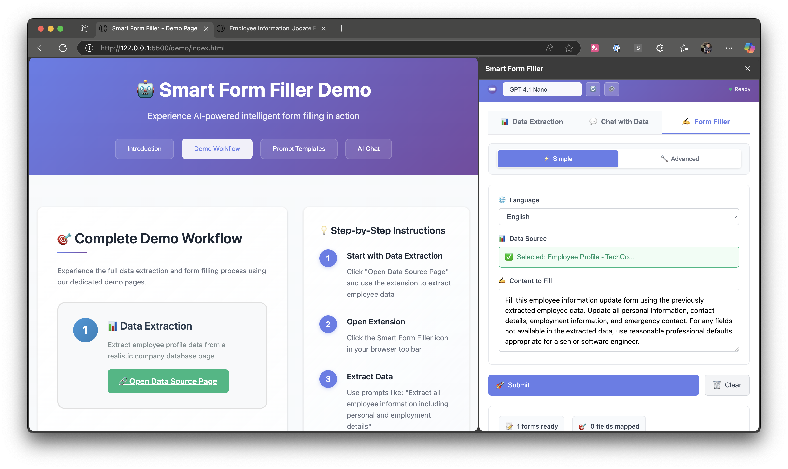

# 智能表单填充器 - AI 驱动的浏览器扩展

一个独立的浏览器扩展，使用 AI 技术实现智能数据提取和表单填充。现已支持 **Ollama 本地模型**！

[](https://github.com/hddevteam/smart-form-filler/releases)
[](LICENSE)
[](https://github.com/hddevteam/smart-form-filler)
[](https://github.com/hddevteam/smart-form-filler)

🌐 **[在线演示与文档](https://hddevteam.github.io/smart-form-filler/)** | 📦 **[下载最新版本](https://github.com/hddevteam/smart-form-filler/releases/latest)** | 📖 **[查看文档](https://github.com/hddevteam/smart-form-filler/wiki)** | 🎥 **[观看演示视频](https://demoforgithub.blob.core.windows.net/videos/smart-form-filler-demo.mp4)**

## 🌍 语言版本

- [🇺🇸 English](README.md) | [🇨🇳 中文](README_zh.md)

## 📸 截图



*智能表单填充器正在分析并自动填充复杂的网页表单*

> **💡 提示**：演示展示了所有主要功能，包括 AI 驱动的表单填充和数据提取

## 🚀 功能特性

- **数据提取**：从网页中提取结构化数据
- **智能表单填充**：AI 驱动的自动表单完成，具备智能字段映射
- **多格式输出**：支持原始 HTML、清理后的 HTML 和 Markdown 格式
- **数据对话**：与提取的内容进行交互式问答
- **本地 AI 模型**：完整的 Ollama 集成，保护隐私的 AI
- **云端 AI 模型**：支持 GPT-4o、o 系列模型、DeepSeek 等云服务提供商
- **后端配置**：内置设置界面，用于配置后端连接
- **服务状态监控**：实时后端连接状态和错误处理
- **智能字段分析**：增强的字段描述，包括下拉框、单选按钮和复选框的可用选项
- **浏览器集成**：与 Chrome 和其他基于 Chromium 的浏览器无缝集成

## 📁 项目结构

```
smart-form-filler/
├── backend/                 # 后端 API 服务器
│   ├── controllers/         # API 控制器
│   ├── services/           # 业务逻辑服务
│   ├── routes/             # API 路由
│   ├── config/             # 配置文件
│   └── server.js           # 主服务器文件
├── extension/              # 浏览器扩展
│   ├── src/                # 扩展源代码
│   ├── manifest.json       # 扩展清单
│   └── popup.html          # 扩展弹出界面
└── package.json            # 根项目配置
```

## 📁 架构与代码组织

### 模块化结构

智能表单填充器扩展已重构为清晰的模块化架构，以提高可维护性和代码组织。**所有文件大小都经过优化**，便于维护。

#### 核心模块

**🎯 主入口点：**
- `popup-main.js` - 轻量级入口点，初始化模块化系统

**📦 核心管理模块：**
- `popupManager.js` - 主协调器，编排所有弹出功能
- `popupInitializer.js` - 处理 DOM 元素初始化和验证
- `popupEventHandlers.js` - 管理所有用户交互和 UI 事件
- `popupModelManager.js` - AI 模型加载、选择和管理
- `popupSettingsManager.js` - 后端配置和设置持久化

**🔧 功能模块：**
- `formFillerHandler.js` - 表单检测和填充功能
- `formAnalysisService.js` - 表单内容分析和映射
- `uiController.js` - UI 状态管理和视觉反馈
- `resultsHandler.js` - 结果显示和数据管理
- `chatHandler.js` - 聊天界面和 AI 交互
- `dataExtractor.js` - 从网页提取页面内容
- `apiClient.js` - 后端 API 通信
- `authManager.js` - 用户身份验证处理

#### 模块化结构的主要优势

✅ **可维护性**：每个模块都有单一职责  
✅ **模块化设计**：适当的文件大小，便于导航和维护  
✅ **可测试性**：模块可以独立测试  
✅ **可扩展性**：新功能可以作为独立模块添加  
✅ **调试友好**：清晰的关注点分离使故障排除更容易  

#### 模块依赖关系

```
popup-main.js
    └── PopupManager
        ├── PopupInitializer (DOM 设置)
        ├── PopupSettingsManager (后端配置)
        ├── PopupModelManager (AI 模型)
        ├── PopupEventHandlers (用户交互)
        └── 功能模块
            ├── FormFillerHandler
            ├── UIController
            ├── ResultsHandler
            ├── ChatHandler
            └── DataExtractor
```

## 🛠️ 安装与设置

### 前置要求
- Node.js（v14 或更高版本）
- npm 或 yarn

### 后端设置
```bash
# 安装依赖
npm run install:all

# 启动开发服务器
npm run dev
```

### 扩展设置
1. 打开 Chrome 并导航到 `chrome://extensions/`（Edge 浏览器使用 `edge://extensions/`）
2. 启用"开发者模式"
3. 点击"加载已解压的扩展程序"并选择 `extension` 文件夹
4. 扩展现在应该出现在您的浏览器工具栏中

### 🎯 在线演示
通过我们的**在线交互式演示**体验所有扩展功能：

**🌐 [https://hddevteam.github.io/smart-form-filler/](https://hddevteam.github.io/smart-form-filler/)**

演示包括：
- **🍽️ 餐厅反馈表单**：完整的真实场景
- **📊 数据提取**：交互式个人资料提取演示  
- **💬 AI 聊天**：与提取数据的聊天功能
- **🎯 提示示例**：生日庆祝、商务晚餐、家庭聚餐等特定场景

#### 演示功能与提示示例
```
🍽️ 满意的顾客：
"以 John Smith (john.smith@techcorp.com) 的身份填写这个餐厅反馈表单，他刚在 Mario's Italian Restaurant 用过晚餐。给出 5 星评价，并对海鲜意大利面和优秀服务给出积极详细的评论。"

🎂 生日庆祝：
"以在这里庆祝生日的人身份填写此反馈。提及惊喜甜点、装饰以及工作人员如何让这个夜晚变得特别。"

💼 商务午餐：
"以带客户到此用餐的商务专业人士身份完成此表单。重点关注安静的氛围、及时的服务和给客户留下深刻印象的优质食物。"
```

## 🔧 开发

### 后端开发
```bash
cd backend
npm run dev
```

后端服务器将在 `http://localhost:3001` 启动

### API 端点
- `GET /api/extension/health` - 健康检查
- `GET /api/extension/models` - 可用的 AI 模型
- `POST /api/extension/extract-data-sources` - 提取页面数据
- `POST /api/extension/chat-with-data` - 与提取的数据聊天
- `POST /api/form-filler/analyze-form-relevance` - 分析表单相关性
- `POST /api/form-filler/analyze-field-mapping` - 生成字段映射

## ⚙️ 配置

### 后端配置

扩展包含一个内置的设置界面，用于配置后端连接：

#### 使用设置界面
1. **打开设置**：点击扩展标题中的 ⚙️ 设置按钮
2. **配置后端 URL**：输入您的后端服务器 URL（默认：`http://localhost:3001`）
3. **测试连接**：点击"测试"验证连接
4. **保存设置**：点击"保存"应用新配置

#### 功能特性
- **持久存储**：设置在浏览器会话间保存
- **连接测试**：实时验证后端连接
- **错误处理**：连接问题的清晰反馈
- **自动重新加载**：后端更改时模型自动刷新

#### 默认配置
```
后端 URL：http://localhost:3001
```

### 环境变量

将 `.env.example` 复制为 `.env` 并配置您的环境变量：

```bash
cd backend
cp .env.example .env
```

### Ollama 配置（可选）
为了支持本地 AI 模型，在您的 `.env` 文件中添加：
```env
OLLAMA_URL=http://localhost:11434
```

## 🤖 Ollama 集成

此扩展支持 **Ollama 本地模型**，提供注重隐私的 AI！在云服务提供商之外使用您自己的本地托管模型。

### 🚀 快速设置

#### 1. 安装 Ollama
访问 [https://ollama.ai/](https://ollama.ai/) 并为您的平台安装 Ollama。

#### 2. 启动 Ollama 服务
```bash
ollama serve
```

#### 3. 下载模型
```bash
# 推荐用于表单填充和数据提取的模型
ollama pull llama2
ollama pull mistral
ollama pull codellama
ollama pull qwen2.5:7b
ollama pull deepseek-r1
```

#### 4. 在扩展中使用
1. 打开扩展弹出窗口
2. 点击"AI 模型"旁边的 🔄 刷新按钮
3. 从**本地模型（Ollama）**或**云模型**中选择
4. 享受私密的本地 AI 处理！

### 🔧 功能特性

- **自动发现**：自动检测运行中的 Ollama 服务器
- **模型热加载**：无需重启即可刷新模型列表
- **统一界面**：在本地和云模型之间无缝切换
- **隐私优先**：使用本地模型时数据永不离开您的机器

### 📋 推荐模型

| 模型 | 用途 | 命令 |
|-------|----------|---------|
| `llama2` | 通用任务 | `ollama pull llama2` |
| `mistral` | 高性能 | `ollama pull mistral` |
| `codellama` | 代码理解 | `ollama pull codellama` |
| `qwen2.5:7b` | 多语言 | `ollama pull qwen2.5:7b` |
| `deepseek-r1` | 推理任务 | `ollama pull deepseek-r1` |

### 🛠️ 故障排除

#### 后端连接问题

**服务不可用消息**
如果您看到"⚠️ 服务不可用 - 检查后端连接"：
1. **检查后端服务器**：确保后端在配置的 URL 上运行
2. **验证 URL**：点击 ⚙️ 设置并验证后端 URL 是否正确
3. **测试连接**：使用设置中的"测试"按钮验证连接
4. **检查网络**：确保没有防火墙或网络问题阻止连接

**模型未加载**
1. **后端状态**：验证后端服务器正在运行（`npm run dev`）
2. **URL 配置**：检查设置中的后端 URL 是否正确
3. **刷新模型**：点击 🔄 刷新按钮
4. **检查日志**：查看浏览器控制台的具体错误消息

#### Ollama 集成问题

**模型未显示？**
1. **检查 Ollama 状态**：`curl http://localhost:11434/api/tags`
2. **列出模型**：`ollama list`
3. **重启 Ollama**：`ollama serve`
4. **刷新扩展**：点击 🔄 按钮

**连接问题？**
- 确保 Ollama 在 `http://localhost:11434` 运行
- 检查防火墙设置
- 如果使用自定义端口，更新 `OLLAMA_URL`

## 🧪 测试

```bash
# 运行测试
npm test
```

## 📦 生产构建

```bash
# 构建生产版本扩展
npm run build:extension
```

## 🤝 贡献

1. Fork 仓库
2. 创建您的功能分支（`git checkout -b feature/amazing-feature`）
3. 提交您的更改（`git commit -m 'Add some amazing feature'`）
4. 推送到分支（`git push origin feature/amazing-feature`）
5. 打开一个 Pull Request

## 📄 许可证

此项目基于 ISC 许可证授权。

## 🔗 相关链接

- [Chrome 扩展开发者指南](https://developer.chrome.com/docs/extensions/)
- [Node.js 文档](https://nodejs.org/docs/)
- [Express.js 文档](https://expressjs.com/)
